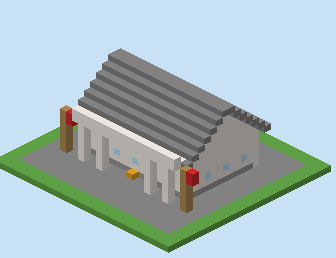
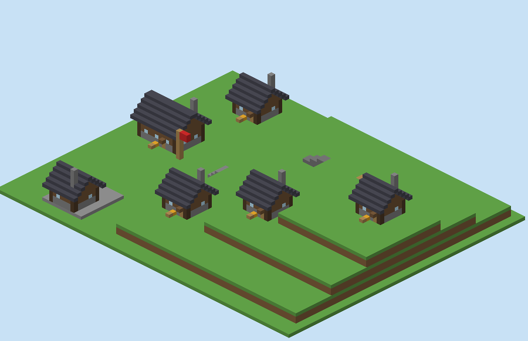
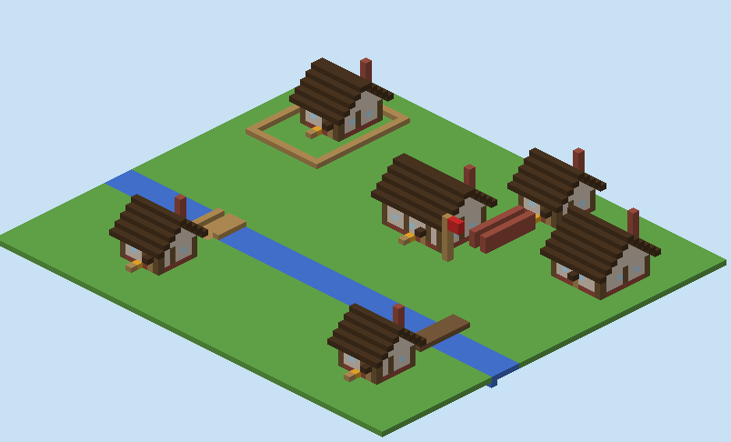
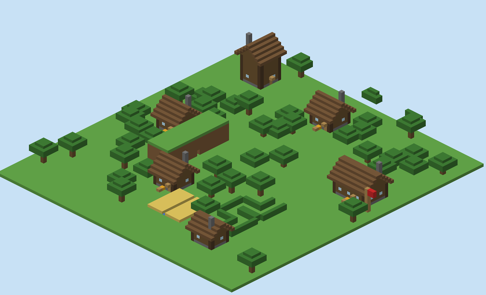
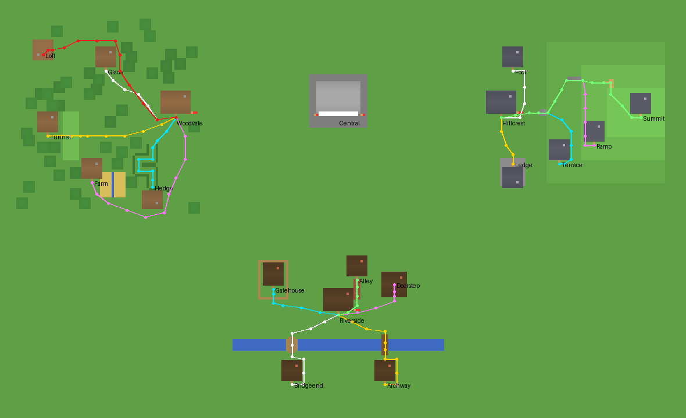

# Test towns

A test world for Postal's pathfinding: three small towns built on a superflat world, each with a post
office and five addresses whose routes cross something a postman has to get past. It exists to test
today's routes and, later, the route automation ideas in `docs/design/routes.md` against the same world.

Everything is generated by `build_towns.py`, so the world is the same block for block on every reset. It's
also reviewable as code. The script writes a data pack (one function, `postal_towns:build`) and the
matching Postal config (Central, the three offices, every address and route). Before writing anything, it
checks that every route is walkable from the blocks it places:
- each step has something to stand on and two blocks of headroom (doors and fence gates count as passable);
- no two waypoints are more than 10 blocks apart.

## The towns

Each town has its own architecture, and every office and address is a building with its mailbox against
the front wall, beside the door, and a name sign above the door:
- **Central** (origin): a white quartz civic post office with a columned portico and two flagpoles.
- **Hillcrest** (east), alpine: stone ground courses, spruce walls, dark slate roofs, stone chimneys.
- **Riverside** (south), Tudor: brick base, white plaster, dark oak timber framing and roofs, brick chimneys.
- **Woodvale** (west), log cabins: horizontal oak logs on cobblestone, spruce roofs, cobblestone chimneys,
  in a forest.

Each post office is larger than the houses and flies a flag in its town's colour.

 
 



Central's postman teleports between offices, so only routes inside each town are walked.

| Town | Office | Address | What the route crosses |
|---|---|---|---|
| **Hillcrest** (east) | (70, -60, 0) | Foot | flat ground |
| | | Ledge | a one-block step up onto a platform |
| | | Terrace | three stone brick stairs |
| | | Ramp | stairs, then a ramp of alternating slabs and full blocks |
| | | Summit | stairs, the slab ramp, then an L-shaped stair with a landing |
| **Riverside** (south) | (0, -60, 85) | Bridgeend | a flat bridge over the river |
| | | Archway | an arched bridge: a stair up, a deck, a stair down |
| | | Gatehouse | a closed fence gate into a yard |
| | | Doorstep | a closed door into a house |
| | | Alley | a one-block-wide alley between walls |
| **Woodvale** (west) | (-70, -60, 0) | Glade | a path winding between trees |
| | | Tunnel | a one-wide, two-high tunnel through a mound |
| | | Hedge | a zigzag corridor between hedges |
| | | Farm | around a wheat field |
| | | Loft | upstairs, only by ladder: **expected to fail** (postmen can't climb) |

## Playing in it

```
SEED_WORLD=towns dev/test-server.sh start --seed
```

This works on a fresh world (`dev/test-server.sh reset` first if you already seeded the flat network). The
towns are built on the first start and the dispatcher starts on its own. `/go Hillcrest` and
`/showroute Hillcrest Summit` work as usual.

## Route soak

```
dev/towns/soak.sh                 # uses the newest target/va_postal-*.jar
SOAK_SECONDS=1800 dev/towns/soak.sh
```

The soak builds a throwaway server, builds the towns and lets the postmen run every route. The default run
is 15 minutes, with fast pacing. It then prints a table of every address:
- whether it was expected to be reached;
- the recorded round trip in seconds;
- how many times a stuck postman had to be **rescued** on that route (teleported on by Postal's stuck-NPC
  handling, with the waypoint it was stuck at);
- the result: **walked** (completed with no rescues), **rescued** (completed only because it was
  teleported past something) or **never** (no round trip completed).

A round trip alone doesn't prove the route works: Postal teleports stuck postmen on, so even Loft, which no
postman can climb to, gets "completed". The rescue count is what tells them apart.

It exits non-zero if an address doesn't behave as expected: one that should be walked was rescued or never
completed, or Loft was walked. Against today's code that's a list of what manual routes and Citizens'
pathfinding can't handle yet; after a change, an address that used to be walked and isn't is a regression.

It isn't part of CI: it takes too long. Run it before and after a change to pathfinding.

## Changing the towns

The buildings come from `World.building` (walls, windows, door, gabled roof, chimney) and
`World.postal_building` (a building behind its mailbox), styled by the `THEMES` table. The generator fails
if a building overlaps anything already placed or isn't on level ground.

After changing the towns, regenerate the pictures:

```
python3 dev/towns/build_towns.py --iso dev/towns/images --map dev/towns/images/map.png
```

Edit `build_towns.py`. The functions `hillcrest`, `riverside` and `woodvale` each place their blocks with
`fill`/`set` and return their office location and routes. Run it with no arguments to check the routes
without writing anything:

```
python3 dev/towns/build_towns.py
```

`DATA_PACK_FORMAT` must match the server's data pack version (from `version.json` in the Paper jar) when
Paper is upgraded.
